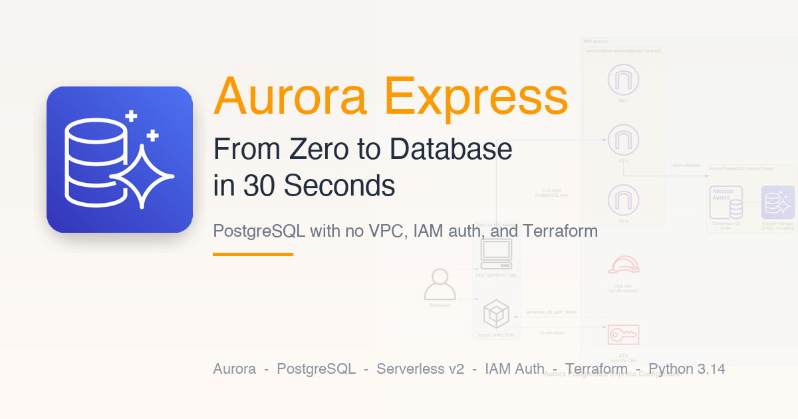
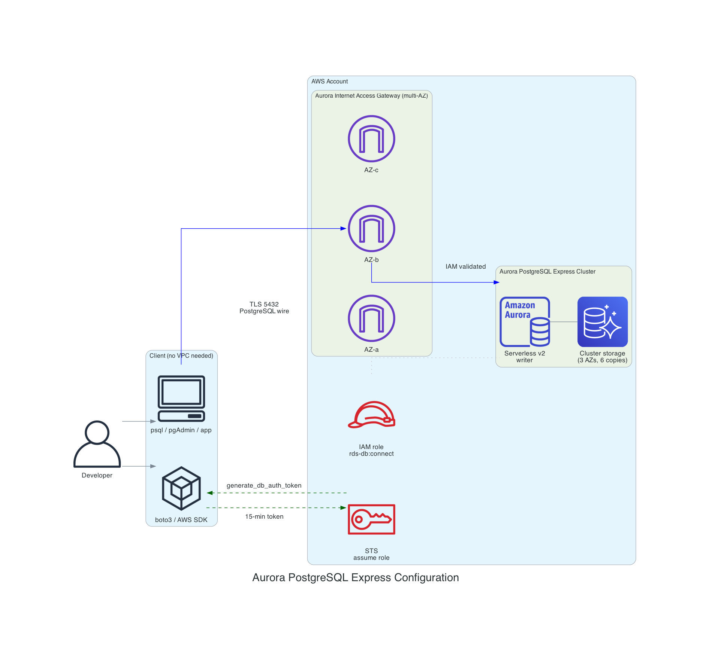
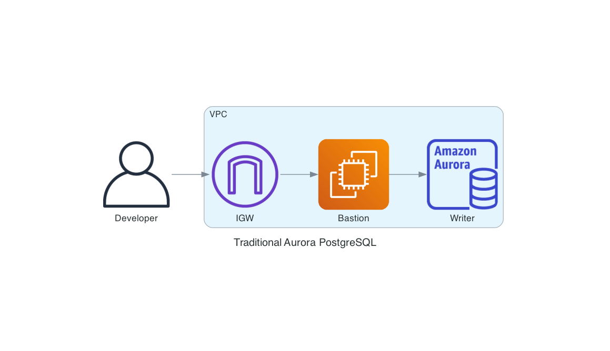
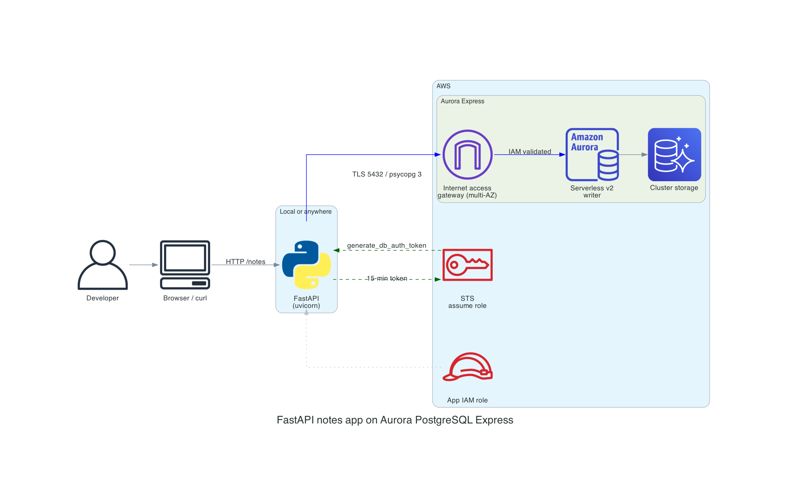

# Aurora PostgreSQL Express Configuration - Practical Examples



Companion code for the blog post: [Aurora PostgreSQL Express Configuration: From Zero to Production Database in 30 Seconds](https://darryl-ruggles.cloud/)

Terraform, Python 3.14, and a small FastAPI application showing how Aurora PostgreSQL Express (GA March 2026) differs from traditional VPC-based Aurora clusters.

## Architecture

### Aurora Express



No VPC, no subnets, no security groups. Clients connect over the internet through the Aurora internet access gateway using TLS and a 15-minute IAM authentication token. Two separate IAM roles: a narrow app role (`app_user` only) and a bootstrap role (`postgres` for one-time schema setup).

### Traditional Aurora (for comparison)



The full configuration path: VPC, IGW, bastion, DB subnet group, security group, and a master password in Secrets Manager.

### Sample FastAPI application



## Repository layout

```text
terraform/                  Aurora Express cluster + IAM roles (hashicorp/aws ~> 6.40)
terraform-traditional/      Aurora Serverless v2 with a VPC (for comparison)
python/                     Python 3.14 samples
  connect.py                IAM-auth connection helper using psycopg 3
  crud.py                   CRUD against the notes table
  app.py                    FastAPI application
  schema.sql                Schema + app_user role
  requirements.txt          Pinned Python dependencies
scripts/
  create-express-cluster.sh The pure AWS CLI path
  delete-express-cluster.sh Teardown for the CLI path
diagrams/                   Architecture diagrams (PNG)
```

## Prerequisites

- AWS account with Aurora PostgreSQL access in a supported region
- AWS CLI v2 configured with credentials
- Terraform >= 1.11
- Python 3.14
- psql (PostgreSQL client) for applying the schema once

## Quick start

### 1. Provision with Terraform

```bash
cd terraform
terraform init
terraform apply -var project_name=express-notes -var environment=dev
```

### 2. Export connection info, create the database, and apply the schema

Express configuration doesn't support `--database-name` at creation time, so the cluster starts with only the default `postgres` database. Create the app database first, then apply the schema:

```bash
eval "$(terraform output -json connection_hint | \
        jq -r 'to_entries | .[] | "export \(.key)=\(.value)"')"

# Generate an IAM auth token (psql doesn't do this automatically)
export PGPASSWORD=$(aws rds generate-db-auth-token \
    --hostname $DB_ENDPOINT --port 5432 --username $DB_USER --region $AWS_REGION)

# Create the app database (express clusters only have "postgres" initially)
psql "host=$DB_ENDPOINT dbname=postgres user=$DB_USER sslmode=verify-full sslrootcert=system" \
     -c "CREATE DATABASE $DB_NAME;"

# Refresh the token and apply the schema to the new database
export PGPASSWORD=$(aws rds generate-db-auth-token \
    --hostname $DB_ENDPOINT --port 5432 --username $DB_USER --region $AWS_REGION)

cd ../python
psql "host=$DB_ENDPOINT dbname=$DB_NAME user=$DB_USER sslmode=verify-full sslrootcert=system" \
     -f schema.sql
```

Or simply use `make schema` which handles token generation automatically.

### 3. Run the FastAPI app

```bash
python3.14 -m venv .venv
source .venv/bin/activate
pip install -r requirements.txt
uvicorn app:app --port 8000
```

```bash
# Create
curl -s localhost:8000/notes -H 'content-type: application/json' \
  -d '{"title":"hello","body":"aurora express notes"}' | jq

# List
curl -s localhost:8000/notes | jq

# Read
curl -s localhost:8000/notes/1 | jq

# Update
curl -s -X PUT localhost:8000/notes/1 -H 'content-type: application/json' \
  -d '{"title":"updated","body":"IAM auth worked out of the box."}' | jq

# Delete
curl -s -X DELETE localhost:8000/notes/1 -w "\n%{http_code}\n"
```

### Alternative: one-shot CLI

```bash
CLUSTER_ID=express-demo scripts/create-express-cluster.sh
```

### Alternative: Make targets

A `Makefile` wraps the full workflow. Run `make help` to see all targets:

```bash
# Aurora Express
make init       # terraform init
make apply      # terraform apply (Aurora Express)
make install    # Create Python venv and install dependencies
make schema     # Create app database + apply schema.sql
make run-app    # Start the FastAPI app on port 8000
make destroy    # terraform destroy
make cli-create # Create cluster with AWS CLI only
make cli-delete # Delete a CLI-created cluster

# Traditional Aurora (VPC comparison)
make trad-init    # terraform init for terraform-traditional/
make trad-plan    # terraform plan
make trad-apply   # terraform apply (creates VPC, subnets, SGs, cluster)
make trad-destroy # terraform destroy

make clean      # Remove local venv and build artifacts
```

You can override the project name, environment, and region:

```bash
make apply PROJECT=my-app ENV=staging REGION=eu-west-1
```

## Configuration

All values are configurable via Terraform variables. No account IDs, cluster IDs, or regions are hardcoded.

### Terraform variables (`terraform/variables.tf`)

| Variable | Default | Description |
|----------|---------|-------------|
| `aws_region` | `us-east-1` | AWS region |
| `project_name` | `aurora-express-demo` | Resource name prefix |
| `environment` | `dev` | Environment tag |
| `db_name` | `appdb` | Initial database name |
| `db_user` | `app_user` | Application DB role used for IAM auth |
| `min_acu` | `0` | Minimum ACUs (0 allows scale-to-zero) |
| `max_acu` | `4` | Maximum ACUs |
| `deletion_protection` | `false` | Enable cluster deletion protection |

### Environment variables for the Python samples

| Variable | Description |
|----------|-------------|
| `DB_ENDPOINT` | Cluster writer endpoint (from Terraform output) |
| `DB_NAME` | Initial database name |
| `DB_USER` | Database user (default `postgres` for admin) |
| `AWS_REGION` | AWS region for token signing |

## Versions

Targeting versions current as of April 2026:

| Tool | Version |
|------|---------|
| Terraform | >= 1.11 |
| AWS Provider | ~> 6.40 |
| Python | 3.14 |
| psycopg | 3.2+ (binary wheels) |
| certifi | 2024+ (CA bundle for TLS to the internet access gateway) |
| boto3 | 1.42.75+ |
| FastAPI | 0.115+ |
| uvicorn | 0.34+ |

## Why the Terraform module shells out to the AWS CLI

As of April 2026, the Terraform AWS provider doesn't yet expose the `--with-express-configuration` flag on `aws_rds_cluster`. The feature reached GA on March 25, 2026.

Tracking issue: [hashicorp/terraform-provider-aws#47117](https://github.com/hashicorp/terraform-provider-aws/issues/47117) (open, filed March 26, 2026). A community contributor has already attempted an implementation and surfaced the core design challenge: `create-db-cluster --with-express-configuration` creates both a cluster and a serverless writer instance from one API call, but Terraform's one-resource-per-state-entry model doesn't line up with that. On destroy the orphan instance prevents the cluster from being deleted.

Until native support lands, this module uses a `null_resource` with a `local-exec` provisioner to call `aws rds create-db-cluster --with-express-configuration`, then reads the resulting cluster back into Terraform state via an `aws_rds_cluster` data source. The destroy provisioner explicitly lists and deletes the child instance before deleting the cluster, working around the exact problem above. Everything downstream (IAM role, outputs) is standard HCL.

When a native argument is added the wrapper can be replaced with a single `aws_rds_cluster` resource without changing the rest of the module.

## Cleanup

To avoid ongoing charges, destroy all resources when you're done. Even with `min_capacity = 0`, the cluster still incurs storage charges ($0.10/GB-month for Aurora Standard) and the cluster remains active until explicitly destroyed.

```bash
# Aurora Express
make destroy

# Traditional Aurora (if deployed)
make trad-destroy

# CLI-created cluster
make cli-delete

# Local artifacts
make clean
```

Note: deletion isn't fast. In testing the Express cluster took 5-11 minutes to fully delete. The "30 seconds" speed advantage is creation-only.

If you're on the AWS Free Tier with Aurora credits, the demo costs are covered while credits last. Once credits are exhausted or if you're on a paid account, an idle Express cluster with an empty database costs under $0.10/month in storage, but the cluster will stay on your bill until you destroy it.

## Related articles

- [Aurora PostgreSQL Express Configuration: From Zero to Production Database in 30 Seconds](https://darryl-ruggles.cloud/) - The blog post this repo accompanies
- [Amazon Aurora DSQL: A Practical Guide to AWS's Distributed SQL Database](https://darryl-ruggles.cloud/amazon-aurora-dsql-a-practical-guide-to-aws-distributed-sql-database/) - Companion piece comparing DSQL to Express
- [AWS Lambda Durable Functions](https://darryl-ruggles.cloud/aws-lambda-durable-functions/) - Serverless workflow orchestration with checkpoints and replay

## Resources

- [Create with express configuration (AWS docs)](https://docs.aws.amazon.com/AmazonRDS/latest/AuroraUserGuide/CHAP_GettingStartedAurora.AuroraPostgreSQL.ExpressConfig.html)
- [Aurora PostgreSQL launch announcement](https://aws.amazon.com/blogs/aws/announcing-amazon-aurora-postgresql-serverless-database-creation-in-seconds/)
- [IAM database authentication for Aurora](https://docs.aws.amazon.com/AmazonRDS/latest/AuroraUserGuide/UsingWithRDS.IAMDBAuth.html)
- [Amazon Aurora on the AWS Free Tier](https://docs.aws.amazon.com/AmazonRDS/latest/AuroraUserGuide/aurora-free-tier.html)
- [Amazon Aurora pricing](https://aws.amazon.com/rds/aurora/pricing/)
- [psycopg 3 documentation](https://www.psycopg.org/psycopg3/docs/)

## Author

**Darryl Ruggles** - [Blog](https://darryl-ruggles.cloud/) | [Bluesky](https://bsky.app/profile/darryl-ruggles.cloud) | [X](https://x.com/RDarrylR) | [LinkedIn](https://www.linkedin.com/in/darryl-ruggles/) | [GitHub](https://github.com/RDarrylR) | [Medium](https://medium.com/@RDarrylR) | [Dev.to](https://dev.to/rdarrylr) | [AWS Community Builder](https://community.aws/@darrylr)

Join the [Believe In Serverless](https://www.believeinserverless.com/) community!

## License

See [LICENSE](LICENSE).
